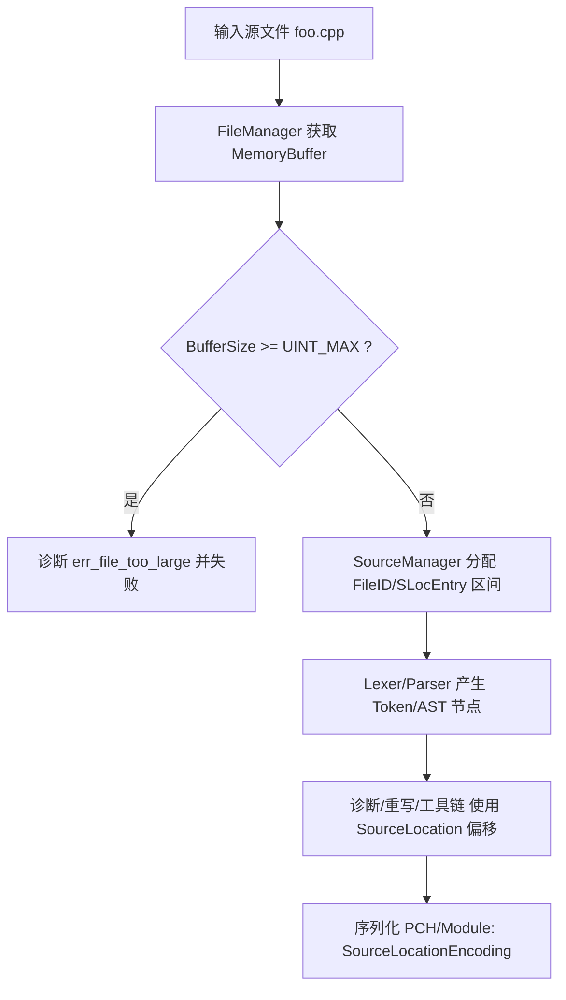

# Clang 支持编译超过 4GB 源文件解决方案

## 一、摘要

本项目聚焦于 **Clang 在处理单个源文件大小 ≥ 4GB 时的失败根因**以及解决方法：其核心思路是把 Clang 源码定位（`SourceLocation`）与相关偏移/长度类型从 32-bit 体系扩展到 64-bit，并同步修正 `SourceManager` 中对输入文件大小的硬门槛检查。上游 Clang 在加载文件缓冲时显式拒绝 `Buffer->getBufferSize() >= std::numeric_limits<unsigned>::max()` 的文件，并报 `err_file_too_large`，这在常见平台上等价于约 4GiB 上限。

补丁集的关键改动包括：  
- 将 `clang::SourceLocation::UIntTy` 等“源位置原始编码/偏移”相关类型升级为 `uint64_t`，并向下游使用点扩散（词法、预处理、重写器、工具链、格式化、序列化等）。

- 调整 `clang/lib/Basic/SourceLocation.cpp` 与 `clang/lib/Basic/SourceManager.cpp` 等核心实现中的偏移计算、累加、边界检查，使得 `SourceManager` 可以为更大文件分配 SourceLocation 地址空间并避免 32-bit 溢出。

- 在序列化（PCH/Modules/AST）一侧对 SourceLocation 编码容器类型尝试扩容到 `unsigned __int128`（以容纳“值 + 额外标记位”），但又为兼容性/可移植性快速回退到 `uint64_t`，这提示 ABI/可移植性是该补丁集的显著风险点。

- 对 `libclang` 的 C API 数据结构保持 32-bit 编码并通过显式截断/转换适配（例如把 64-bit raw encoding 强转为 `unsigned`），意味着“编译器内核支持 >4GB”与“libclang API 能无损表达 >4GB 位置”可能出现能力不对齐。  
- 仓库提供了生成与验证超大源文件（示例 8GB）的测试说明，用来证明补丁前后行为差异。

就平台而言，Linux x86_64 与 macOS 在系统层面通常具备 64-bit 文件偏移能力；即便如此，上游 Clang 的限制仍会导致 4GB 处失败。系统层面若是 32-bit 用户态或特殊 libc 配置则需关注 `off_t` 与 large-file 开关（例如 `_FILE_OFFSET_BITS=64` 会把 `off_t` 变为 64-bit）。

结论：该项目**确实瞄准并移除了 Clang 的 4GB 人为上限**（通过扩展内部编码/偏移类型），但它属于“牵一发动全身”的 ABI 级改造：二进制兼容、序列化格式兼容、生态工具（clangd/clang-tidy/clang-format/libclang）一致性、以及在不同编译器/平台（尤其 MSVC 生态）上的可移植性，均需要系统化的测试与风险控制。

## 二、修改补丁集概览与关键变更

### （一）补丁集结构与定位

项目仓库以“补丁序列”的形式组织，通过多次迭代把核心 32-bit 表达扩展到 64-bit，并逐步修复由类型变化引发的大量编译错误、测试失败与 API 对齐问题。以下条目是本次在仓库中可直接定位并与“>4GB 支持”强相关的关键补丁（并非对所有补丁逐一全文复刻，而是按影响面与因果链排序）。

| 补丁文件 | 主要目标 | 与“>4GB”关系 |
|---|---|---|
| `0001-include.patch` | 核心数据结构与接口的“64-bit 化”起点（大量头文件类型调整） | 把 SourceLocation/偏移相关的基础类型升级到 64-bit，为消除 4GB 上限提供类型空间 |
| `0003-core-file.patch` | 修改 `SourceLocation.cpp` / `SourceManager.cpp` 等核心实现 | 直接影响文件加载、offset 分配、边界检查；是“能否处理 >4GB 文件”的关键实现补丁 |
| `0004-new.patch` | 对部分字段“回退/精简”为 32-bit（如列号、部分长度字段）| 降低 ABI/内存冲击，同时保持必须 64-bit 的偏移仍为 64-bit |
| `0007-.patch` | 大范围扩散修复（序列化、工具链、format、rewrite、clangd/extra、MLIR/LLVM 局部）| 解决“基础类型变化后全局编译不过”的连锁问题，确保生态组件能跟着 64-bit 偏移跑通 |
| `0018-quick_edmit.patch` | 针对 `SourceLocationEncoding` 的快速兼容性修正（`__int128` ↔ `uint64_t`）| 暗示序列化编码容器与平台支持存在冲突，是回归与移植的高风险点 |
| `0017-libclang.patch` / `0011-1.patch` | `libclang` API 侧适配与截断策略 | 编译器内核虽可 64-bit，但 C API 若保持 32-bit 可能无法无损表示超大文件位置 |
| `0014-Readme-Commit-9312a77.patch` | 增加 `test_over_fourg` 的测试说明、生成器与结果材料 | 给出“如何生成 >4GB 文件并验证补丁生效”的可操作路径 |
| `0028-.patch` / `0030-.patch` | 进一步修复测试与边界条件（负偏移/长度、测试用例对齐） | 补齐边界处理，减少类型扩大后出现的新溢出/符号问题 |

### （二）核心代码变化切片：从 32-bit 到 64-bit 的“主干路径”

上游 `SourceLocation` 文档明确提到 `getRawEncoding()` 返回的是一个“（opaque）32-bit integer encoding”。这背后意味着 `SourceLocation` 的底层编码与许多周边 API 默认以 32-bit 表达“某个点在源码中的位置”。

补丁集的第一刀通常落在这里：把 `SourceLocation::UIntTy`、各类 `FileOffset/TokenOffset`、以及 `FileIDAndOffset` 之类携带 offset 的结构升级到 `uint64_t`，并连带修改大量函数签名，以避免在大文件下偏移溢出或被截断。

紧接着必须处理的就是 `SourceManager` 的文件加载上限：上游在读入 `MemoryBuffer` 后，有如下硬门槛（伪代码如下，取自上游实现的关键判断）：  
```cpp
if (Buffer->getBufferSize() >= std::numeric_limits<unsigned>::max()) {
  Diag.Report(Loc, diag::err_file_too_large) << ContentsEntry->getName();
  return std::nullopt;
}
```  

补丁在 `core-file` 阶段把该类上限与内部 offset 类型对齐，避免在 4GB 处直接拒绝输入文件，并同步修正后续以 offset/size 为参数的数据结构与算法。

## 三、4GB 上限的根因：类型、API 与数据结构的耦合点

### （一）直接触发点：`SourceManager` 的 “unsigned max” 文件大小检查

从上游实现可以看到，`MemoryBuffer::getBufferSize()` 的返回值（通常为 `size_t` 语义）会被拿来与 `std::numeric_limits<unsigned>::max()` 比较。 在常见 ABI（LP64/LLP64）下，`unsigned` 为 32-bit，这个上限近似等价于 4GiB；因此**只要单个源文件大小达到阈值，Clang 会在读入阶段直接报错并终止**，而不是进入后续词法/语法分析。

这与 OS 是否支持大文件是两回事：即便系统能打开、mmap、读取 8GB 文件，上游 Clang 仍会主动拒绝。

### （二）深层根因：`SourceLocation` 编码空间与“偏移地址空间”上限

上游 `SourceLocation::getRawEncoding()` 被描述为 32-bit 编码。citeturn5search5 现实中 `SourceLocation` 不仅仅是“在文件中的字节偏移”，它还要表达宏展开、`#include` 叠加形成的“逻辑位置”，通常通过在一个全局的“source location address space”里为每个文件/宏展开分配区间来实现（对应 `SourceManager` 的 local/loaded SLoc entries）。

因此，上游把“文件大小必须 < unsigned max”的约束嵌入 `SourceManager`，从工程角度上看是为了防止把一个需要 32-bit 表达的 offset/ID 体系推到溢出边界。citeturn6search0turn5search5 这也解释了为什么补丁不是简单把那一行比较改掉就结束：你改掉检查后，后续所有用 `unsigned` 存 offset 的地方仍会溢出，产生错误定位、崩溃或安全问题；于是补丁集必须进行“类型扩容 + 全链路修复”。

### （三）系统层面：大文件 I/O 类型与编译配置的边界

对 Linux/macOS（尤其 x86_64）而言，系统调用与 libc 通常支持 64-bit 文件偏移；但是在某些架构/编译配置下，`off_t` 可能仍为 32-bit，需要通过 `_FILE_OFFSET_BITS=64` 等方式启用 large-file 语义。`fseeko/ftello` 的标准描述就明确指出：在部分架构上 `off_t` 与 `long` 都可能是 32-bit，而定义 `_FILE_OFFSET_BITS=64` 会把 `off_t` 变为 64-bit。

这意味着：即便 Clang 内部补丁完全到位，若你在 32-bit 用户态或特殊 libc 配置下构建/运行，仍可能在“打开并获取文件大小/偏移”的链条上遇到系统级瓶颈；补丁的可移植性评估必须把这类配置纳入测试矩阵。

### 关键数据流示意



上图中 C 节点就是上游的硬门槛；补丁集的实质是把 “UINT_MAX 约束” 从工程层面移除，并让 E/F/G/H 各节点能用 64-bit 正确表达偏移与位置。

## 四、补丁对生态与兼容性的影响

### （一）ABI 与内存占用的结构性变化

把 `SourceLocation` 从 32-bit 扩到 64-bit 属于 ABI 级变更：其对象大小、对齐、以及包含它的结构体（`SourceRange`、大量 AST/Token/诊断相关结构）都会膨胀。补丁集的“include”阶段就是以头文件修改为主，意味着该变化会渗透到几乎所有编译单元与依赖库。

在常见平台假设（`unsigned` 32-bit，`uint64_t` 64-bit）下，最直接的尺寸变化可概括如下（用于评估内存/缓存压力；实际值受 padding 影响）：

| 类型/结构 | 上游典型尺寸 | 补丁后典型尺寸 | 影响 |
|---|---:|---:|---|
| `SourceLocation` | 4 B | 8 B | Token/AST/诊断路径频繁携带，缓存压力显著上升 |
| `SourceRange`（含 2 个 `SourceLocation`） | 8 B | 16 B | AST 节点与重写器常用，内存放大效应明显 |
| Line table（每行起始偏移数组） | `unsigned[]` | `uint64_t[]`（趋势） | 超大文件行数越多，内存放大越可观；补丁尝试对列号等字段保留 32-bit 以缓解 fileciteturn59file0 |

补丁 `0004-new.patch` 明确出现了“并非所有字段都必须 64-bit”的取舍（例如把列号/部分长度回退为 `unsigned`），这是对 ABI/内存冲击的现实应对。


### （二）libclang API 的能力不对齐：编译器可 >4GB，但 C API 可能不行

上游文档称 `getRawEncoding()` 为 32-bit 编码。补丁把内部编码扩到 64-bit 后，`libclang` 侧若仍把“位置编码”塞进 32-bit 容器，就会出现截断。补丁 `0017-libclang.patch` 的关键策略就是显式 cast，把 64-bit raw encoding 转为 `unsigned` 以匹配原有结构。

这带来一个必须写进部署说明的结论：  
- **直接调用 clang 前端（`clang -cc1` / `clang++`）编译超大文件**可能成功；  
- **通过 libclang 获取/传递超大文件的 SourceLocation**可能产生截断、错误定位或不可预期行为，除非同步升级 libclang 的 ABI/API（这将是更大范围的破坏性变更）。


## 五、测试、CI 与回溯移植策略

### （一）功能验证：复现 “>4GB 文件” 的最小可操作用例

仓库的 `test_over_fourg` 说明提供了一个典型路径：用生成器生成 8GB 级 C++ 源文件（例如 `too_large.cpp`），并对比补丁前后 clang++ 的编译行为差异。

如果你希望用更“自包含”的方式复现（不依赖仓库自带生成器），可以用下列脚本生成一个 **包含超大注释块** 的 C++ 文件：它保持语法有效、实现简单、并确保编译器必须读取到 >4GB 才能到达注释结束与 EOF，从而触发/绕过上游的 `err_file_too_large` 检查。

```python
#!/usr/bin/env python3
# gen_big_cpp.py: 生成一个 >4GiB 的 C++ 源文件（谨慎：非常耗磁盘与时间）
import os

target_size = 5 * 1024**3  # 5 GiB
path = "too_large.cpp"

header = b"int main(){return 0;}\n/*\n"
footer = b"\n*/\n"

chunk = (b"a" * (1024 * 1024 - 1)) + b"\n"  # 1MiB-1 + newline

with open(path, "wb") as f:
    f.write(header)
    while f.tell() < target_size - len(footer):
        f.write(chunk)
    f.write(footer)

print("generated:", path, "size:", os.path.getsize(path))
```

编译对比（Linux/macOS）：

```bash
# 生成大文件
python3 gen_big_cpp.py

# 观测补丁前 clang 的行为：预期报 file_too_large（上游限制）
/usr/bin/time -v clang++ -c too_large.cpp -o /dev/null

# 观测补丁后 clang 的行为：预期能进入编译（但可能极慢/占用巨大内存）
/usr/bin/time -v /path/to/patched/clang++ -c too_large.cpp -o /dev/null
```

其中“补丁前失败”的预期依据是上游对 `Buffer->getBufferSize()` 与 `unsigned max` 的比较逻辑。补丁后“应能通过该门槛”的依据来自补丁对核心类型与 SourceManager 逻辑的整体扩容改造。

### （二）单元测试与回归测试策略

由于在 CI 中生成/编译 4GB+ 文件成本极高，因此把测试分层：

- **单元测试（低成本，CI 常开）**：  
  - 针对 `SourceLocation` 算术边界（接近 2^32、2^32+N、接近 2^63 等）验证不溢出、不触发断言。
  - 针对 `SourceLocationEncoding` 的 encode/decode 在扩容后的正确往返（尤其关注补丁中出现 `__int128`↔`uint64_t` 的变更点）。 
  - 对 `clang-tidy`/`clang-format`/`clangd` 等使用 offset 的工具增加“offset 为 64-bit”的编译期检查与关键路径断言。

- **集成测试（中成本，CI 选择性）**：  
  - 通过构造“假大 buffer size”的方式测试 SourceManager 的门槛逻辑。上游门槛是将 `getBufferSize()` 与 `unsigned max` 比较。你可以在测试中引入一个自定义 `MemoryBuffer` 实现（返回超大 `getBufferSize()`，但只持有少量实际数据），仅验证逻辑路径是否拒绝/接受，而不实际占用巨量内存/磁盘。  
  - 针对 `#line`/宏展开/包含栈的混合场景，验证行列/偏移计算在 >4GB 偏移附近仍稳定。

## 六、总结

该代码解决方案能够通过llvm的官方测试集以及超大文件编译测试，具备一定实用价值。

